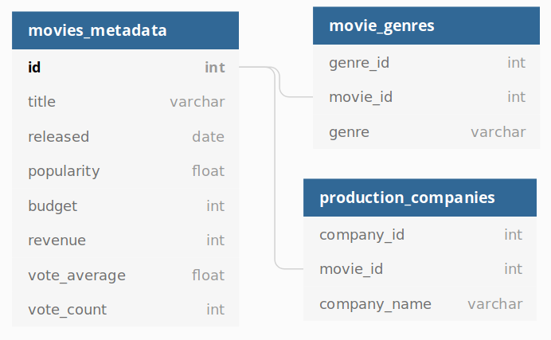

# GUILD DATA ENGINEERING PRE-HIRE PROJECT

This is a prehire project performed by Jared Stewart for the role Principal Data Scientist at Guild Education.

In this project I will demonstrate
 * my ability to get at, stash, and make available data
 * provide a discussion for the basis of building out the hypothetical system for production

 The source data for this project was pulled from https://s3-us-west-2.amazonaws.com/com.guild.us-west-2.public-data/project-data/the-movies-dataset.zip

---
## Execution

To run have docker and python3 installed; then

```
> sudo chmod 754 launch_postgres.sh
> launch_postgres.sh
> cd python
> source ./.venv/bin/activate
> python main.py
```

---
 ## Data Model

 The requested functionality is to expose the following information

 * Production Company Details
    - Budget per yearstudios
    - Revenue per year
    - Profit per year
    - Releases by genre per year
    - Average popularity of movies produced per year

 * Movie Genre Details
    - Genre popularity per year
    - Budget per year
    - Revenue per year
    - Profit per year

This data can be sourced from the movies-metadata.csv file which takes the form:

|adult|belongs_to_collection                                                                                                                                |budget  |genres                                                                                          |homepage                            |id |imdb_id  |original_language|original_title|overview                                                                                                                                                                                                                                                                                                       |popularity|poster_path                     |production_companies                          |production_countries                                      |release_date|revenue  |runtime|spoken_languages                        |status  |tagline|title    |video|vote_average|vote_count|
|-----|-----------------------------------------------------------------------------------------------------------------------------------------------------|--------|------------------------------------------------------------------------------------------------|------------------------------------|---|---------|-----------------|--------------|---------------------------------------------------------------------------------------------------------------------------------------------------------------------------------------------------------------------------------------------------------------------------------------------------------------|----------|--------------------------------|----------------------------------------------|----------------------------------------------------------|------------|---------|-------|----------------------------------------|--------|-------|---------|-----|------------|----------|
|False|{'id': 10194, 'name': 'Toy Story Collection', 'poster_path': '/7G9915LfUQ2lVfwMEEhDsn3kT4B.jpg', 'backdrop_path': '/9FBwqcd9IRruEDUrTdcaafOMKUq.jpg'}|30000000|[{'id': 16, 'name': 'Animation'}, {'id': 35, 'name': 'Comedy'}, {'id': 10751, 'name': 'Family'}]|http://toystory.disney.com/toy-story|862|tt0114709|en               |Toy Story     |Led by Woody...|21.946943 |/rhIRbceoE9lR4veEXuwCC2wARtG.jpg|[{'name': 'Pixar Animation Studios', 'id': 3}]|[{'iso_3166_1': 'US', 'name': 'United States of America'}]|1995-10-30  |373554033|81.0   |[{'iso_639_1': 'en', 'name': 'English'}]|Released|       |Toy Story|False|7.7         |5415      |

Both of the genres and production companies fields take on a JSON like structure (for now I am assuming it's a conforming JSON array) with the genres field appearing as:

```
[
    {'id': 16, 'name': 'Animation'}, 
    {'id': 35, 'name': 'Comedy'}, 
    {'id': 10751, 'name': 'Family'}
]
```

and the production companies field appearing as:

```
[
    {'name': 'Pixar Animation Studios', 'id': 3}
]
```

each presents a particular challenge where there are many movies that share a particular genre (or production company) and each movie may have many genres (or production companies). This is a pretty clear cut example of a many-to-many relationship.

The simplest way to produce the needed views is using SQL which can naturally model the many-to-many relationships with the Production Companies and the Genres. Furthermore, SQL will give us the best performance (without building some sophisticated indexing structure) for a particular query we might be interested in relating to this data. The following figure demonstrates a possible data model for storing this information into a SQL database. 



This particular model facilitates (mostly) simple aggregation queries allowing us to easily (and efficiently) produced the requested reports. 

The requirements document doesn't specify whether we should report the AVERAGE or the SUM of the various components. To me it makes the most sense to report the SUM, however I can also see the AVERAGE as being an interesting quantity. Fortunately enough, the switch from SUM to average is pretty straightforward.

Additionally, there is the matter of popularity. The movies_metadata.csv provides three fields that could be interpreted as (mostly) related to the film's popularity. These are {popularity, vote_average, vote_count}. Additionally, there is the ratings.csv which could ostensibly be used to assess film popularity. For now, it is acceptable to assume that the intended measure is the popularity column from the movies_metadata.csv - this is because this is the exact name of a field and additionally, it is not particularly clear whether a movie with a high vote average (but a low number of votes) should be considered popular. 

For the production company aggregation the following query should be used:

```
SELECT 
    EXTRACT(year FROM movie.released) AS yyyy,
    company.company_name,
    SUM(movie.budget) AS cumulative_budget,
    SUM(movie.revenue) AS cumulative_revenue,
    cumulative_revenue - cumulative_budget,
    AVG(movie.popularity)
FROM production_companies AS company 
LEFT JOIN movies_metadata AS movie ON company.movie_id = movie.id
GROUP BY yyyy, company.company_name
ORDER BY company.company_name ASC, yyyy ASC;
```

**NB**: This SQL query _does not_ resolve the need to aggregate the number of releases by genre per year. I take issue with the summation of the number of films produced by genre for a company. This is because each film can have any number of genre tags associated with it, and as a result it will appear that the production studio produced more movies than they did. _Artificially inflating the number of films released by each studio is probably not the desired behavior_.

To achieve this a different query is recommended:

```
SELECT
    EXTRACT(year from movie.released) as yyyy,
    company.company_name,
    genre.genre_name,
    COUNT(movie.released)
FROM production_companies AS company
LEFT JOIN movies_metadata AS movie on company.movie_id = movie.id
LEFT JOIN movie_genres AS genre ON company.movie_id = genre.id
GROUP BY yyyy, company.company_name, genre.genre_name
ORDER BY company.company ASC, yyyy ASC, genre.genre_name ASC
```

The aggregation of the genre information is similar to the first query taking the form of:

```
SELECT 
    EXTRACT(year FROM movie.released) AS yyyy,
    genre.genre_name,
    AVG(movie.popularity) AS genre_popularity,
    SUM(movie.budget) AS cumulative_budget,
    SUM(movie.revenue) AS cumulative_revenue,
    cumulative_revenue - cumulative_budget
FROM movie_genres AS genre
LEFT JOIN movies_metadata AS movie ON genre.movie_id = movie.id
GROUP BY yyyy, genre.genre_name
ORDER BY yyyy ASC, genre_popularity DESC;
```

In this final query, the column presentation order is changed to allow for a more intuitive interpretation of the data. The user is able to see the most popular genre as the first row for each year.

There is an argument to be made for precomputing the desired results - afterall, this is a system which receives new data once a month with the expectation that the results are presented on a yearly basis. However, this reduces the amount of flexibility toward meeting new requirements (suppose we were later asked to compare same-month revenue for a production studio...). If we optimized to this degree, yes the data size would be negligible, but the system would only work for the requirements specified at system inception. If at any point we wanted to deliver on new requirements we would find this quite difficult. Applying a minimal structure - as demonstrated above, provides a basic optimization without tying us to tightly to this iteration of requirements.

---
## Implementation

The ingestion process I have implemented for testing purposes is simply loading the csv directly into pandas. This is convenient for a number of purposes. In a real world example it is the basis for performing the Exploratory Data Analysis (EDA) of our data to understand what quirks we are putting into our database. It also has a really robust read_csv function. Finally, the sqlalchemy library provides a very simple and easy to use to_sql() method allowing for us to directly deliver the data to our postgres instance.

That said, there are some challenges to the dataset. For many movies the recorded budget/revenue. There are challenges with parsing the csv - some records have special characters which break the recod. And there is also the occasional **GATORADE** to handle - fortunately some of us are somewhat thirsty. For now, a minimal data cleaning approach is taken which handles a number of these issues. 

The postgres instance is stood up on the localhost using docker. In practice, there is no reason to bind it specifically to localhost - but docker makes it (mostly) infinitely portable. 

In the long run we would setup the sql instance as part of a docker swarm or a kubernetes cluster along with monitoring/alert services and a REST API (or similar) service to serve the data. Ingestion (expected monthly for now) could take place using a cron job or airflow.

In terms of scalability, the simplest method would be to expand horizontally. With only monthly data ingestion (of what appears to be a small dataset), spreading the data and the application out over several nodes would allow us to scale indefinitely (as long as budget scales indefinitely too). There are some interesting race conditions that could occur when we are ingesting data every month (such as not all nodes are simultaneously updated), but these issues would be very small and given a properly designed service we could provide notifications to our users that the data has been updated since their last query. 

If the service gets hot enough (meaning we wouldn't have to worry about cold starts) we could explore migrating to a serverless architecture which could (theoretically) be more cost efficient as the computing needs would scale dynamically with demand.

We can also run out of scale if our data gets to be too big to just read into pandas, clean, format, and push to sql (this itself isn't particularly scalable - pandas is pretty darn slow). We could refine this process further by 

On the other hand, if the data starts getting updated more frequently (say faster than once per second), we could try to work out a solution with the data supplier to have the data migrated to a push system (where they directly send new data to us), or try to find a solution allowing us to parallelize multiple pulls of the data service. The data we acquire could then be added to a message brokering system like Kafka for later consumption by a diverse group of user programs on an as needed basis.